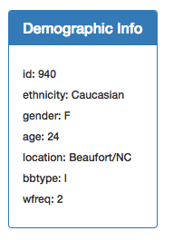

# Plot.ly - Interactive visualization of Belly Button Biodiversity Dataset

This project builds an interactive dashboard to explore the [Belly Button Biodiversity dataset](http://robdunnlab.com/projects/belly-button-biodiversity/), which catalogs the microbes that colonize human navels.

The dataset reveals that a small handful of microbial species (also called operational taxonomic units, or OTUs, in the study) were present in more than 70% of people, while the rest were relatively rare.

## The project includes the following:

1. Use of the D3 library to read in `samples.json`, plotly, JS, HTML, JSON, and CSS.

2. Creation of a horizontal bar chart with a dropdown menu to display the top 10 OTUs found in that individual.

  

3. Creation of a bubble chart that displays each sample.

4. A panel that displays the sample metadata, i.e., an individual's demographic information.

5. A guage chart that plots the weekly washing frequency of the individual.

6. A drop-down selection that update all of the plots any time that a new sample is selected.

## Advanced Challenge Assignment (Optional)

The following task is advanced and therefore optional.

* Adapt the Gauge Chart from <https://plot.ly/javascript/gauge-charts/> to plot the weekly washing frequency of the individual.

* You will need to modify the example gauge code to account for values ranging from 0 through 9.

* Update the chart whenever a new sample is selected.

## Deployment

* The app is deployed on GitHub pages 

* The 

app.js - Includes code for the basic dashboard plots

bonus.js = Includes code for the basic dashboard plots plus the guage and additional formatting and customization to give the dashboard a better appearance.